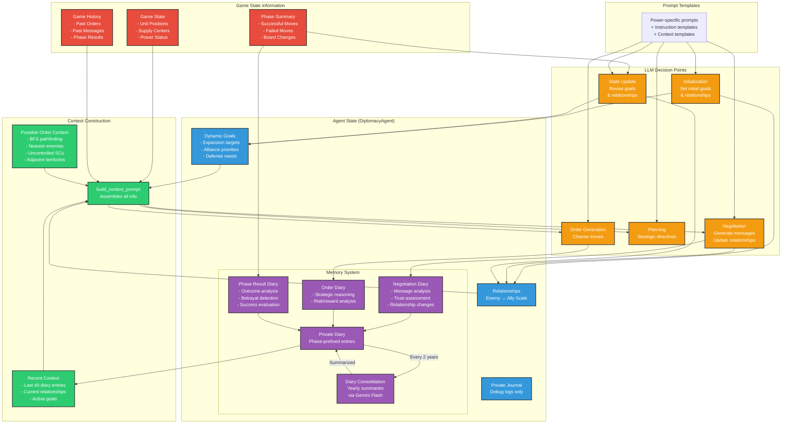

# AI Diplomacy: LLM-Powered Strategic Gameplay

## Overview

This repository extends the original [Diplomacy](https://github.com/diplomacy/diplomacy) project with sophisticated AI agents powered by Large Language Models (LLMs). Each power in the game is controlled by an autonomous agent that maintains state, forms relationships, conducts negotiations, and makes strategic decisions.

## Key Features

### 🤖 Stateful AI Agents
Each power is represented by a `DiplomacyAgent` with:
- **Dynamic Goals**: Strategic objectives that evolve based on game events
- **Relationship Tracking**: Maintains relationships (Enemy/Unfriendly/Neutral/Friendly/Ally) with other powers
- **Memory System**: Dual-layer memory with structured diary entries and consolidation
- **Personality**: Power-specific system prompts shape each agent's diplomatic style

### 💬 Rich Negotiations
- Multi-round message exchanges (private and global)
- Relationship-aware communication strategies
- Message history tracking and analysis
- Detection of ignored messages and non-responsive powers

### 🎯 Strategic Order Generation & LLM Integration
- **Core LLM Abstraction**: Built around Simon Willison's `llm` library, providing a unified and flexible interface for diverse language models. This is a key architectural pillar, replacing previous client systems for enhanced maintainability and broader model access.
- **Broad Model Compatibility**:
    - Supports major API-based models (Grok, OpenAI, Anthropic Claude, Google Gemini, etc.).
    - **Robust Local-Only Mode**: Extensive support for local LLMs via Ollama and llama.cpp (through `llm` plugins), enabling private, offline gameplay and development. Recent stability enhancements (e.g., serialized requests for local models, automatic configuration, EOF error resolution) make local play with Ollama seamless and reliable.
- **Tactical Analysis**: Employs BFS pathfinding for movement analysis, aiding in strategic decision-making.
- **Context-Aware Decisions**: Orders are selected based on comprehensive context, including identified threats, opportunities, and current game state.
- **Resilient Operation**: Includes fallback logic to ensure agents can still function effectively even with unexpected or incomplete LLM outputs.

### 📊 Advanced Game Analysis
- Custom phase summaries with success/failure categorization
- Betrayal detection through order/negotiation comparison
- Strategic planning phases for high-level directives
- Comprehensive logging of all LLM interactions

### 🧠 Memory Management
- **Private Diary**: Structured, phase-prefixed entries for LLM context
  - Negotiation summaries with relationship updates
  - Order reasoning and strategic justifications
  - Phase result analysis with betrayal detection
- **Yearly Consolidation**: Automatic summarization of old entries to prevent context overflow
- **Smart Context Building**: Only relevant history provided to LLMs

## Recent Updates (Key Stability & Reliability Enhancements)

- **Zero EOF Errors**: Resolved all "unexpected EOF" issues with local LLMs (like Ollama) by serializing concurrent requests and implementing robust retry logic with exponential backoff. Games now run to completion reliably.
- **Rock-Solid Concurrency**: Replaced manual lock management with a new async context manager (`serial_access`) for guaranteed lock safety and automatic serialization of local LLM calls. No more deadlocks or race conditions.
- **Dynamic & Robust Agent Behavior**:
    - Agents now dynamically update relationships and goals thanks to flexible JSON parsing (`extract_relationships`, `extract_goals`) that handles various LLM response formats.
    - Initialization bugs in agents have been fixed for cleaner and more reliable startup.
- **Simplified Configuration**: Local LLM serialization is now automatic, removing the need for environment variables like `SERIALIZE_LOCAL_LLMS_ENV_VAR`.
- **Centralized LLM Interaction**: Core LLM call logic, JSON parsing, and error handling are now centralized (e.g., `call_llm_with_json_parsing`, `LLMCallResult`), significantly reducing code duplication (~250+ lines removed) and improving maintainability.
- **Template Error Fixes**: Corrected issues in prompt templates for more reliable LLM responses.

These updates have transformed the system from a fragile prototype into a production-ready, robust AI diplomacy engine capable of running full 7-player games without interruption.

## How AI Agents Work

The following diagram illustrates the complete information flow and decision-making process for each AI agent:



### Illustrative Agent API Usage

The refactored `LLMAgent` (a type of `BaseAgent`) exposes a clean asynchronous API for interaction within the game loop. Here's a conceptual example of how an agent might be driven:

```python
# Conceptual example:
# Assuming 'agent' is an initialized LLMAgent instance
# and 'current_phase_state' is a PhaseState object representing the current game state.

# 1. Negotiation Phase
# Agent generates diplomatic messages
messages_to_send = await agent.negotiate(current_phase_state)
for msg in messages_to_send:
    # Send messages to other powers or global chat
    print(f"To {msg.recipient}: {msg.content}")

# 2. Order Decision Phase
# Agent decides on its orders for the current phase
# The decide_orders method now returns a list of Order objects.
# The game orchestrator would typically convert these to strings if needed by the game engine.
orders_to_submit = await agent.decide_orders(current_phase_state)
for order_obj in orders_to_submit:
    print(f"Order: {order_obj.order_str}") # Access the string representation

# (Game engine processes the phase based on submitted orders from all agents)

# 3. State Update Phase
# After the phase is processed, the agent updates its internal state
# 'phase_state_after_processing' is the PhaseState after orders are resolved
# 'events_this_phase' is a list of significant occurrences (e.g., attacks, captures)
# await agent.update_state(phase_state_after_processing, events_this_phase)

print("Agent has completed its turn actions and updated its state.")
```
This example highlights the core asynchronous methods `negotiate`, `decide_orders`, and `update_state` that form the primary interaction points with an `LLMAgent`.

### Key Components Explained

1. **Information Sources**
   - **Game State**: Current board position, unit locations, supply center ownership
   - **Game History**: Complete record of past orders, messages, and results
   - **Phase Summaries**: Categorized analysis of what succeeded/failed each turn

2. **Agent Memory Architecture**
   - **Private Diary**: The main memory system, with structured entries for each phase
   - **Diary Types**: Three specialized entry types capture different aspects of gameplay
   - **Consolidation**: Automatic yearly summarization prevents context overflow
   - **Journal**: Unstructured logs for debugging (not used by LLMs)

3. **Context Building**
   - **Strategic Analysis**: BFS pathfinding identifies threats and opportunities
   - **Relationship Context**: Current diplomatic standings influence all decisions
   - **Historical Context**: Recent diary entries provide continuity

4. **LLM Decision Points**
   - **Initialization**: Sets starting personality and objectives
   - **Negotiations**: Generates contextual messages based on relationships
   - **Planning**: Creates high-level strategic directives
   - **Orders**: Selects specific moves with full strategic context
   - **State Updates**: Adjusts goals and relationships based on outcomes

### Implementation Details

#### Core Files

1. **`lm_game.py`** - Main game orchestrator
   - Manages agent lifecycle and game phases
   - Coordinates async LLM calls. **Note**: For local LLMs, calls are now effectively serialized by default to ensure stability.
   - Handles error tracking and recovery
   - Saves game state with phase summaries and agent relationships

2. **`ai_diplomacy/agent.py`** - Stateful agent implementation
   - `DiplomacyAgent` class with goals, relationships, and memory
   - Robust JSON parsing for various LLM response formats (enhanced with `extract_relationships` and `extract_goals` utilities).
   - Diary entry generation for each game event
   - State update logic based on game outcomes
   - Initialization logic streamlined and bugs fixed.

3. **`ai_diplomacy/llm_coordinator.py` (Conceptual - formerly `clients.py` logic now more distributed & part of agent/llm library)**
   - LLM interaction is managed via Simon Willison's `llm` library and its plugins.
   - The `DiplomacyAgent` directly uses `llm.get_model()` and `model.async_prompt()`.
   - **New**: A conceptual `LocalLLMCoordinator` (or similar pattern within agent/game orchestrator) now handles:
        - `serial_access()`: An `@asynccontextmanager` to ensure local LLM calls are serialized, preventing crashes.
        - `call_llm_with_retry()`: Implements retry logic with exponential backoff for LLM calls.
        - `call_llm_with_json_parsing()`: Centralized function for making LLM calls, parsing JSON, and handling errors, now with integrated retry logic.

4. **`ai_diplomacy/possible_order_context.py`** - Strategic analysis
   - BFS pathfinding on game map
   - Nearest threat/opportunity identification
   - Adjacent territory analysis
   - Rich XML context generation for orders

5. **`ai_diplomacy/prompt_constructor.py`** - Centralized prompt building
   - Assembles game state, agent state, and strategic context
   - Formats prompts for different LLM tasks
   - Integrates with template system

6. **`ai_diplomacy/game_history.py`** - Phase-by-phase game tracking
   - Stores messages, orders, and results
   - Provides historical context for agents
   - Tracks ignored messages for relationship analysis

#### Prompt Templates

The `ai_diplomacy/prompts/` directory contains customizable templates:
- Power-specific system prompts (e.g., `france_system_prompt.txt`)
- Task-specific instructions (`order_instructions.txt`, `conversation_instructions.txt`)
- Diary generation prompts for different game events
- State update and planning templates

### Running AI Games

```bash
# Basic game with negotiations
python lm_game.py --max_year 1910 --num_negotiation_rounds 3

# With strategic planning phase
python lm_game.py --max_year 1910 --planning_phase --num_negotiation_rounds 2

# Custom model assignment (order: AUSTRIA, ENGLAND, FRANCE, GERMANY, ITALY, RUSSIA, TURKEY)
# Model IDs should be compatible with the `llm` library.
python lm_game.py --models "claude-3.5-sonnet,gpt-4o,ollama/llama3,openrouter/google/gemini-pro,gpt-3.5-turbo,claude-3-opus,gemini-1.5-flash-latest"

# Output to specific file
python lm_game.py --output results/my_game.json
```

### Environment Setup

1.  **Install Core Dependencies**:
    ```bash
    pip install -r requirements.txt 
    # Ensure `llm` is included or install separately:
    pip install llm
    ```

2.  **Install `llm` Plugins**:
    This project uses the [llm library by Simon Willison](https://llm.datasette.io/) for interacting with language models. You'll need to install `llm` and its relevant plugins for the models you intend to use:
    ```bash
    # Example plugins (install those you need):
    llm install llm-openai    # For OpenAI models (GPT-3.5, GPT-4, etc.)
    llm install llm-claude    # For Anthropic Claude models
    llm install llm-gemini    # For Google Gemini models
    llm install llm-ollama    # For local models via Ollama
    llm install llm-llama-cpp # For local models via llama.cpp (GGUF)
    # Find more plugins at https://llm.datasette.io/en/latest/plugins.html#community-plugins
    ```

3.  **API Key Setup (using `llm` library)**:
    Set your API keys using the `llm` command-line tool. This securely stores your keys for use by the library.
    ```bash
    llm keys set openai YOUR_OPENAI_API_KEY
    llm keys set anthropic YOUR_ANTHROPIC_API_KEY
    llm keys set gemini YOUR_GEMINI_API_KEY
    llm keys set openrouter YOUR_OPENROUTER_API_KEY 
    # Add other keys as needed for installed plugins.
    ```
    For services accessed via an OpenAI-compatible endpoint (like a local `llama.cpp` server not using `llm-llama-cpp`), you might still use an environment variable like `OPENAI_API_BASE_URL` if you are using the `llm-openai` plugin to target this custom endpoint. The `llm-llama-cpp` and `llm-ollama` plugins typically handle endpoint configuration automatically or through their own settings.

    Create a `.env` file in the project root for any other specific environment variables (e.g., `OPENAI_API_BASE_URL` if needed for a custom OpenAI-compatible endpoint).
    ```env
    # .env (Example for a custom OpenAI-compatible endpoint)
    # OPENAI_API_BASE_URL="http://localhost:8080/v1" 
    # OPENAI_API_KEY="sk-dummy" # Often needed even if server doesn't check it
    ```

### Game Output and Analysis

Games are saved to the `results/` directory with timestamps. Each game folder contains:
- `lmvsgame.json` - Complete game data including phase summaries and agent relationships
- `overview.jsonl` - Error statistics and model assignments
- `game_manifesto.txt` - Strategic directives from planning phases
- `general_game.log` - Detailed game execution logs
- `llm_responses.csv` - Complete log of all LLM interactions

The game JSON includes special fields for AI analysis:
- `phase_summaries` - Categorized move results for each phase
- `agent_relationships` - Diplomatic standings at each phase
- `final_agent_states` - End-game goals and relationships

### Future Explorations

- **Adaptive Negotiations**: Dynamic round count based on conversation flow
- **Coalition Detection**: Identify and track multi-power alliances
- **Personality Evolution**: Agents that adapt their diplomatic style
- **Tournament Mode**: Automated multi-game competitions with ELO ratings
- **Human-AI Hybrid**: Allow human players to compete against AI agents
- **Real-time Commentary**: Live narrative generation for spectators

---


<p align="center">
  
</p>

## Documentation

The complete documentation is available at [diplomacy.readthedocs.io](https://diplomacy.readthedocs.io/).

## Getting Started

### Installation

The latest version of the base `diplomacy` package can be installed with:

```bash
pip install diplomacy
```
This project requires additional dependencies as listed in `requirements.txt` (including `llm` and potentially `llm` plugins). See "Environment Setup" above for details on setting up the AI components.

The package is compatible with Python 3.8+.

### Running a game

The following script plays a game locally by submitting random valid orders until the game is completed.

```python3
import random
from diplomacy import Game
from diplomacy.utils.export import to_saved_game_format

# Creating a game
# Alternatively, a map_name can be specified as an argument. e.g. Game(map_name='pure')
game = Game()
while not game.is_game_done:

    # Getting the list of possible orders for all locations
    possible_orders = game.get_all_possible_orders()

    # For each power, randomly sampling a valid order
    for power_name, power in game.powers.items():
        power_orders = [random.choice(possible_orders[loc]) for loc in game.get_orderable_locations(power_name)
                        if possible_orders[loc]]
        game.set_orders(power_name, power_orders)

    # Messages can be sent locally with game.add_message
    # e.g. game.add_message(Message(sender='FRANCE',
    #                               recipient='ENGLAND',
    #                               message='This is a message',
    #                               phase=self.get_current_phase(),
    #                               time_sent=int(time.time())))

    # Processing the game to move to the next phase
    game.process()

# Exporting the game to disk to visualize (game is appended to file)
# Alternatively, we can do >> file.write(json.dumps(to_saved_game_format(game)))
to_saved_game_format(game, output_path='game.json')
```

## Web interface

It is also possible to install a web interface in React to play against bots and/or other humans and to visualize games.

The web interface can be installed with:

```bash
# Install NVM
curl -o- https://raw.githubusercontent.com/nvm-sh/nvm/v0.34.0/install.sh | bash

# Clone repo
git clone https://github.com/diplomacy/diplomacy.git

# Install package locally
# You may want to install it in a conda or virtualenv environment
cd diplomacy/
pip install -r requirements_dev.txt

# Build node modules
cd diplomacy/web
npm install .
npm install . --only=dev

# In a terminal window or tab - Launch React server
npm start

# In another terminal window or tab - Launch diplomacy server
python -m diplomacy.server.run
```

The web interface will be accessible at http://localhost:3000.

To login, users can use admin/password or username/password. Additional users can be created by logging in with a username that does not exist in the database.


### Visualizing a game

It is possible to visualize a game by using the "Load a game from disk" menu on the top-right corner of the web interface.


## Network Game

It is possible to join a game remotely over a network using websockets. The script below plays a game over a network.

Note. The server must be started with `python -m diplomacy.server.run` for the script to work.
The `network_lm_agent.py` script (part of this AI-Diplomacy project) also uses `llm`-compatible model IDs specified via the `--model_id` argument. Ensure the environment where each agent runs has `llm` installed, the necessary plugins, and API keys configured as described in the "Environment Setup" section. Refer to `docs/LOCAL_NETWORK_OLLAMA_SETUP.md` for detailed instructions on network play with local LLMs.

```python3
import asyncio
import random
from diplomacy.client.connection import connect
from diplomacy.utils import exceptions

POWERS = ['AUSTRIA', 'ENGLAND', 'FRANCE', 'GERMANY', 'ITALY', 'RUSSIA', 'TURKEY']

async def create_game(game_id, hostname='localhost', port=8432):
    """ Creates a game on the server """
    connection = await connect(hostname, port)
    channel = await connection.authenticate('random_user', 'password')
    await channel.create_game(game_id=game_id, rules={'REAL_TIME', 'NO_DEADLINE', 'POWER_CHOICE'})

async def play(game_id, power_name, hostname='localhost', port=8432):
    """ Play as the specified power """
    connection = await connect(hostname, port)
    channel = await connection.authenticate('user_' + power_name, 'password')

    # Waiting for the game, then joining it
    while not (await channel.list_games(game_id=game_id)):
        await asyncio.sleep(1.)
    game = await channel.join_game(game_id=game_id, power_name=power_name)

    # Playing game
    while not game.is_game_done:
        current_phase = game.get_current_phase()

        # Submitting orders
        if game.get_orderable_locations(power_name):
            possible_orders = game.get_all_possible_orders()
            orders = [random.choice(possible_orders[loc]) for loc in game.get_orderable_locations(power_name)
                      if possible_orders[loc]]
            print('[%s/%s] - Submitted: %s' % (power_name, game.get_current_phase(), orders))
            await game.set_orders(power_name=power_name, orders=orders, wait=False)

        # Messages can be sent with game.send_message
        # await game.send_game_message(message=game.new_power_message('FRANCE', 'This is the message'))

        # Waiting for game to be processed
        while current_phase == game.get_current_phase():
            await asyncio.sleep(0.1)

    # A local copy of the game can be saved with to_saved_game_format
    # To download a copy of the game with messages from all powers, you need to export the game as an admin
    # by logging in as 'admin' / 'password'

async def launch(game_id):
    """ Creates and plays a network game """
    await create_game(game_id)
    await asyncio.gather(*[play(game_id, power_name) for power_name in POWERS])

if __name__ == '__main__':
    asyncio.run(launch(game_id=str(random.randint(1, 1000))))

## License

This project is licensed under the APGLv3 License - see the [LICENSE](LICENSE) file for details
