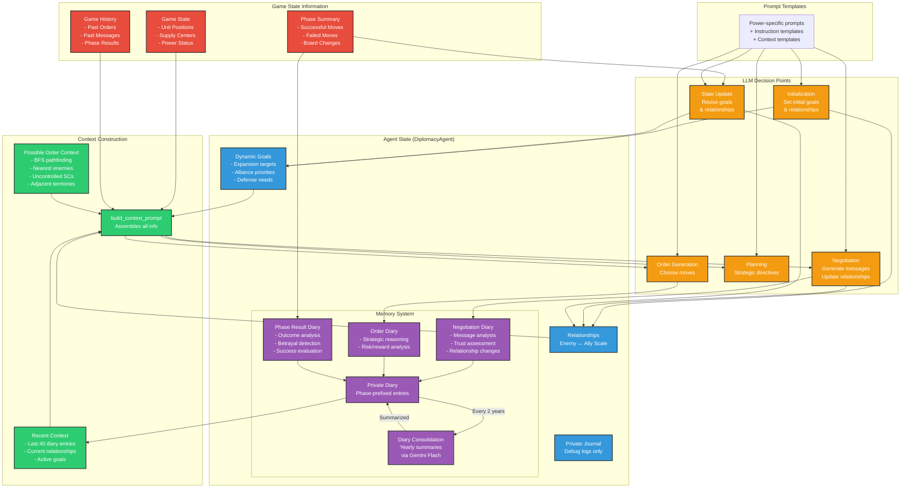

# AI Diplomacy: LLM-Powered Strategic Gameplay
## Created by Alex Duffy @Alx-Ai

## Overview

This repository extends the original [Diplomacy](https://github.com/diplomacy/diplomacy) project with sophisticated AI agents powered by Large Language Models (LLMs). Each power in the game is controlled by an autonomous agent that maintains state, forms relationships, conducts negotiations, and makes strategic decisions.

## Key Features

### 🤖 Stateful AI Agents
Each power is represented by a `DiplomacyAgent` with:
- **Dynamic Goals**: Strategic objectives that evolve based on game events
- **Relationship Tracking**: Maintains relationships (Enemy/Unfriendly/Neutral/Friendly/Ally) with other powers
- **Memory System**: Dual-layer memory with structured diary entries and consolidation
- **Personality**: Power-specific system prompts shape each agent's diplomatic style

### 💬 Rich Negotiations
- Multi-round message exchanges (private and global)
- Relationship-aware communication strategies
- Message history tracking and analysis
- Detection of ignored messages and non-responsive powers

### 🎯 Strategic Order Generation
- BFS pathfinding for movement analysis
- Context-aware order selection with nearest threats/opportunities
- Fallback logic for robustness
- Support for multiple LLM providers (OpenAI, Claude, Gemini, DeepSeek, OpenRouter)

### 📊 Advanced Game Analysis
- Custom phase summaries with success/failure categorization
- Betrayal detection through order/negotiation comparison
- Strategic planning phases for high-level directives
- Comprehensive logging of all LLM interactions

### 🧠 Memory Management
- **Private Diary**: Structured, phase-prefixed entries for LLM context
  - Negotiation summaries with relationship updates
  - Order reasoning and strategic justifications
  - Phase result analysis with betrayal detection
- **Yearly Consolidation**: Automatic summarization of old entries to prevent context overflow
- **Smart Context Building**: Only relevant history provided to LLMs

## How AI Agents Work

The following diagram illustrates the complete information flow and decision-making process for each AI agent:



### Key Components Explained

1. **Information Sources**
   - **Game State**: Current board position, unit locations, supply center ownership
   - **Game History**: Complete record of past orders, messages, and results
   - **Phase Summaries**: Categorized analysis of what succeeded/failed each turn

2. **Agent Memory Architecture**
   - **Private Diary**: The main memory system, with structured entries for each phase
   - **Diary Types**: Three specialized entry types capture different aspects of gameplay
   - **Consolidation**: Automatic yearly summarization prevents context overflow
   - **Journal**: Unstructured logs for debugging (not used by LLMs)

3. **Context Building**
   - **Strategic Analysis**: BFS pathfinding identifies threats and opportunities
   - **Relationship Context**: Current diplomatic standings influence all decisions
   - **Historical Context**: Recent diary entries provide continuity

4. **LLM Decision Points**
   - **Initialization**: Sets starting personality and objectives
   - **Negotiations**: Generates contextual messages based on relationships
   - **Planning**: Creates high-level strategic directives
   - **Orders**: Selects specific moves with full strategic context
   - **State Updates**: Adjusts goals and relationships based on outcomes

### Implementation Details

#### Core Files

1. **`lm_game.py`** - Main game orchestrator
   - Manages agent lifecycle and game phases
   - Coordinates async LLM calls for maximum performance
   - Handles error tracking and recovery
   - Saves game state with phase summaries and agent relationships

2. **`ai_diplomacy/agent.py`** - Stateful agent implementation
   - `DiplomacyAgent` class with goals, relationships, and memory
   - Robust JSON parsing for various LLM response formats
   - Diary entry generation for each game event
   - State update logic based on game outcomes

3. **`ai_diplomacy/clients.py`** - LLM abstraction layer
   - `BaseModelClient` interface for all LLM providers
   - Implementations for OpenAI, Claude, Gemini, DeepSeek, OpenRouter
   - Prompt construction and response parsing
   - Retry logic and error handling

4. **`ai_diplomacy/possible_order_context.py`** - Strategic analysis
   - BFS pathfinding on game map
   - Nearest threat/opportunity identification
   - Adjacent territory analysis
   - Rich XML context generation for orders

5. **`ai_diplomacy/prompt_constructor.py`** - Centralized prompt building
   - Assembles game state, agent state, and strategic context
   - Formats prompts for different LLM tasks
   - Integrates with template system

6. **`ai_diplomacy/game_history.py`** - Phase-by-phase game tracking
   - Stores messages, orders, and results
   - Provides historical context for agents
   - Tracks ignored messages for relationship analysis

#### Prompt Templates

The `ai_diplomacy/prompts/` directory contains customizable templates:
- Power-specific system prompts (e.g., `france_system_prompt.txt`)
- Task-specific instructions (`order_instructions.txt`, `conversation_instructions.txt`)
- Diary generation prompts for different game events
- State update and planning templates

### Running AI Games

```bash
# Basic game with negotiations
python lm_game.py --max_year 1910 --num_negotiation_rounds 3

# With strategic planning phase
python lm_game.py --max_year 1910 --planning_phase --num_negotiation_rounds 2

# Custom model assignment (order: AUSTRIA, ENGLAND, FRANCE, GERMANY, ITALY, RUSSIA, TURKEY)
python lm_game.py --models "claude-3-5-sonnet-20241022,gpt-4o,claude-3-5-sonnet-20241022,gpt-4o,claude-3-5-sonnet-20241022,gpt-4o,claude-3-5-sonnet-20241022"

# Output to specific file
python lm_game.py --output results/my_game.json

# Run until game completion or specific year
python lm_game.py --num_negotiation_rounds 2 --planning_phase
```

### Environment Setup

Create a `.env` file with your API keys:
```
OPENAI_API_KEY=your_key_here
ANTHROPIC_API_KEY=your_key_here
GEMINI_API_KEY=your_key_here
DEEPSEEK_API_KEY=your_key_here
OPENROUTER_API_KEY=your_key_here
```

### Model Configuration

Models can be assigned to powers in `ai_diplomacy/utils.py`:
```python
def assign_models_to_powers() -> Dict[str, str]:
    return {
        "AUSTRIA": "o3",
        "ENGLAND": "claude-sonnet-4-20250514",
        "FRANCE": "gpt-4.1",
        "GERMANY": "gemini-2.5-pro-preview-05-06",
        "ITALY": "openrouter-meta-llama/llama-4-maverick",
        "RUSSIA": "claude-opus-4-20250514",
        "TURKEY": "openrouter-google/gemini-2.5-flash-preview-05-20",
    }
```

Supported models include:
- OpenAI: `gpt-4o`, `gpt-4.1`, `o3`, `o4-mini`
- Anthropic: `claude-3-5-sonnet-20241022`, `claude-opus-4-20250514`
- Google: `gemini-2.0-flash`, `gemini-2.5-pro-preview`
- OpenRouter: Various models including Llama, Qwen, DeepSeek

### Game Output and Analysis

Games are saved to the `results/` directory with timestamps. Each game folder contains:
- `lmvsgame.json` - Complete game data including phase summaries and agent relationships
- `overview.jsonl` - Error statistics and model assignments
- `game_manifesto.txt` - Strategic directives from planning phases
- `general_game.log` - Detailed game execution logs
- `llm_responses.csv` - Complete log of all LLM interactions

The game JSON includes special fields for AI analysis:
- `phase_summaries` - Categorized move results for each phase
- `agent_relationships` - Diplomatic standings at each phase
- `final_agent_states` - End-game goals and relationships

### Post-Game Analysis Tools

#### Strategic Moment Analysis

Analyze games for key strategic moments including betrayals, collaborations, and brilliant strategies:

```bash
# Analyze a completed game
python analyze_game_moments.py results/20250522_210700_o3vclaudes_o3win

# Limit analysis to specific phases
python analyze_game_moments.py results/game_folder --max-phases 20

# Use a different analysis model
python analyze_game_moments.py results/game_folder --model claude-3-5-sonnet-20241022
```

The analysis identifies:
- **Betrayals**: When powers explicitly promise one action but take contradictory action
- **Collaborations**: Successfully coordinated actions between powers
- **Playing Both Sides**: Powers making conflicting promises to different parties
- **Brilliant Strategies**: Exceptionally well-executed strategic maneuvers
- **Strategic Blunders**: Major mistakes that significantly weaken a position

Analysis outputs include:
- **Markdown Report** (`game_moments/[game]_report_[timestamp].md`)
  - AI-generated narrative of the entire game
  - Summary statistics (betrayals, collaborations, etc.)
  - Invalid move counts by model
  - Lie analysis with intentional vs unintentional breakdown
  - Top strategic moments with full context and diary entries
- **JSON Data** (`game_moments/[game]_data_[timestamp].json`)
  - Complete structured data of all detected moments
  - Metadata including scores, categories, and relationships
  - Raw lie detection data for further analysis

Example output snippet:
```markdown
## Power Models
- **TURKEY**: o3
- **ENGLAND**: claude-sonnet-4-20250514
- **RUSSIA**: claude-opus-4-20250514

## Invalid Moves by Model
- **o3**: 91 invalid moves
- **claude-sonnet-4**: 67 invalid moves

## Lies Analysis
### Lies by Model
- **o3**: 195 total lies (71 intentional, 124 unintentional)
- **claude-opus-4**: 96 total lies (0 intentional, 96 unintentional)
```

#### Diplomatic Lie Detection

The analysis system can detect lies by comparing:
1. **Messages**: What powers promise to each other
2. **Private Diaries**: What powers privately plan (from negotiation_diary entries)
3. **Actual Orders**: What they actually do

Lies are classified as:
- **Intentional**: Diary shows planned deception (e.g., "mislead them", "while actually...")
- **Unintentional**: No evidence of planned deception (likely misunderstandings)

#### Animation and Visualization

Visualize games with the interactive 3D animation system:

```bash
# Start the animation server
cd ai_animation
npm install
npm run dev

# Open http://localhost:5173 in your browser
# Load a game JSON file to see animated playback
```

Features:
- 3D map with unit movements and battles
- Phase-by-phase playback controls
- Chat window showing diplomatic messages
- Standings board tracking supply centers
- Sound effects and visual flourishes

### Game Statistics and Patterns

Analysis of hundreds of AI games reveals interesting patterns:

#### Model Performance Characteristics
- **Invalid Move Rates**: Some models (e.g., o3) generate more invalid moves but play aggressively
- **Deception Patterns**: Models vary dramatically in honesty (0-100% intentional lie rates)
- **Strategic Styles**: From defensive/honest to aggressive/deceptive playstyles

#### Common Strategic Patterns
- **Opening Gambits**: RT Juggernaut (Russia-Turkey), Western Triple, Lepanto
- **Mid-game Dynamics**: Stab timing, alliance shifts, convoy operations
- **Endgame Challenges**: Stalemate lines, forced draws, kingmaking

### Future Explorations

- **Adaptive Negotiations**: Dynamic round count based on conversation flow
- **Coalition Detection**: Identify and track multi-power alliances
- **Personality Evolution**: Agents that adapt their diplomatic style
- **Tournament Mode**: Automated multi-game competitions with ELO ratings
- **Human-AI Hybrid**: Allow human players to compete against AI agents
- **Real-time Commentary**: Live narrative generation for spectators
- **Deception Training**: Models specifically trained to detect or execute lies
- **Meta-Strategy Learning**: Agents that learn from previous games

---


<p align="center">
  
</p>

## Documentation

The complete documentation is available at [diplomacy.readthedocs.io](https://diplomacy.readthedocs.io/).

## Available Analysis Scripts

### 1. Strategic Moment Analysis (`analyze_game_moments.py`)

Comprehensive analysis of game dynamics:
```bash
python analyze_game_moments.py results/game_folder [options]

Options:
  --model MODEL         Analysis model to use (default: gemini-2.5-flash)
  --max-phases N        Analyze only first N phases
  --max-concurrent N    Concurrent API calls (default: 5)
  --report PATH         Output report path (auto-generated if not specified)
  --json PATH           Output JSON path (auto-generated if not specified)
```

### 2. Focused Lie Detection (`analyze_lies_focused.py`)

Detailed analysis of diplomatic deception:
```bash
python analyze_lies_focused.py results/game_folder [--output report.md]
```

### 3. Game Visualization (`ai_animation/`)

Interactive 3D visualization of games:
```bash
cd ai_animation
npm install
npm run dev
# Open http://localhost:5173 and load a game JSON
```

## Getting Started

### Installation

The latest version of the package can be installed with:

```python3
pip install diplomacy
```

The package is compatible with Python 3.5, 3.6, and 3.7.

### Running a game

The following script plays a game locally by submitting random valid orders until the game is completed.

```python3
import random
from diplomacy import Game
from diplomacy.utils.export import to_saved_game_format

# Creating a game
# Alternatively, a map_name can be specified as an argument. e.g. Game(map_name='pure')
game = Game()
while not game.is_game_done:

    # Getting the list of possible orders for all locations
    possible_orders = game.get_all_possible_orders()

    # For each power, randomly sampling a valid order
    for power_name, power in game.powers.items():
        power_orders = [random.choice(possible_orders[loc]) for loc in game.get_orderable_locations(power_name)
                        if possible_orders[loc]]
        game.set_orders(power_name, power_orders)

    # Messages can be sent locally with game.add_message
    # e.g. game.add_message(Message(sender='FRANCE',
    #                               recipient='ENGLAND',
    #                               message='This is a message',
    #                               phase=self.get_current_phase(),
    #                               time_sent=int(time.time())))

    # Processing the game to move to the next phase
    game.process()

# Exporting the game to disk to visualize (game is appended to file)
# Alternatively, we can do >> file.write(json.dumps(to_saved_game_format(game)))
to_saved_game_format(game, output_path='game.json')
```

## Web interface

It is also possible to install a web interface in React to play against bots and/or other humans and to visualize games.

The web interface can be installed with:

```bash
# Install NVM
curl -o- https://raw.githubusercontent.com/nvm-sh/nvm/v0.34.0/install.sh | bash

# Clone repo
git clone https://github.com/diplomacy/diplomacy.git

# Install package locally
# You may want to install it in a conda or virtualenv environment
cd diplomacy/
pip install -r requirements_dev.txt

# Build node modules
cd diplomacy/web
npm install .
npm install . --only=dev

# In a terminal window or tab - Launch React server
npm start

# In another terminal window or tab - Launch diplomacy server
python -m diplomacy.server.run
```

The web interface will be accessible at http://localhost:3000.

To login, users can use admin/password or username/password. Additional users can be created by logging in with a username that does not exist in the database.


### Visualizing a game

It is possible to visualize a game by using the "Load a game from disk" menu on the top-right corner of the web interface.


## Network Game

It is possible to join a game remotely over a network using websockets. The script below plays a game over a network.

Note. The server must be started with `python -m diplomacy.server.run` for the script to work.

```python3
import asyncio
import random
from diplomacy.client.connection import connect
from diplomacy.utils import exceptions

POWERS = ['AUSTRIA', 'ENGLAND', 'FRANCE', 'GERMANY', 'ITALY', 'RUSSIA', 'TURKEY']

async def create_game(game_id, hostname='localhost', port=8432):
    """ Creates a game on the server """
    connection = await connect(hostname, port)
    channel = await connection.authenticate('random_user', 'password')
    await channel.create_game(game_id=game_id, rules={'REAL_TIME', 'NO_DEADLINE', 'POWER_CHOICE'})

async def play(game_id, power_name, hostname='localhost', port=8432):
    """ Play as the specified power """
    connection = await connect(hostname, port)
    channel = await connection.authenticate('user_' + power_name, 'password')

    # Waiting for the game, then joining it
    while not (await channel.list_games(game_id=game_id)):
        await asyncio.sleep(1.)
    game = await channel.join_game(game_id=game_id, power_name=power_name)

    # Playing game
    while not game.is_game_done:
        current_phase = game.get_current_phase()

        # Submitting orders
        if game.get_orderable_locations(power_name):
            possible_orders = game.get_all_possible_orders()
            orders = [random.choice(possible_orders[loc]) for loc in game.get_orderable_locations(power_name)
                      if possible_orders[loc]]
            print('[%s/%s] - Submitted: %s' % (power_name, game.get_current_phase(), orders))
            await game.set_orders(power_name=power_name, orders=orders, wait=False)

        # Messages can be sent with game.send_message
        # await game.send_game_message(message=game.new_power_message('FRANCE', 'This is the message'))

        # Waiting for game to be processed
        while current_phase == game.get_current_phase():
            await asyncio.sleep(0.1)

    # A local copy of the game can be saved with to_saved_game_format
    # To download a copy of the game with messages from all powers, you need to export the game as an admin
    # by logging in as 'admin' / 'password'

async def launch(game_id):
    """ Creates and plays a network game """
    await create_game(game_id)
    await asyncio.gather(*[play(game_id, power_name) for power_name in POWERS])

if __name__ == '__main__':
    asyncio.run(launch(game_id=str(random.randint(1, 1000))))

## License

This project is licensed under the APGLv3 License - see the [LICENSE](LICENSE) file for details
