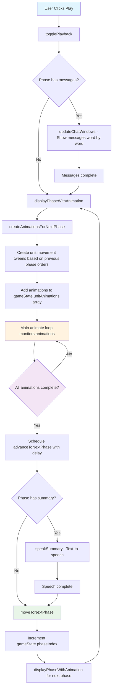

# AI Diplomacy Animation

A Three.js-based visualization of Diplomacy game states showing animated conversations between AI players and unit movements.

## Turn Animation System

The application uses a sophisticated turn-based animation system that coordinates multiple types of animations through game phases.

### Architecture Overview

The turn animation system is built around several key components that work together to create smooth, coordinated transitions:

1. **Main Game Loop** (`src/main.ts`): Continuous animation loop that monitors all animation states
2. **Game State Management** (`src/gameState.ts`): Central state coordination with boolean locks
3. **Phase Management** (`src/phase.ts`): Handles phase transitions and orchestration
4. **Unit Animation System** (`src/units/animate.ts`): Creates and manages unit movement tweens

### How Turn Animations Advance

The turn advancement follows a carefully orchestrated sequence:

#### 1. Playback Initiation

When the user clicks Play, `togglePlayback()` is triggered, which:

- Sets `gameState.isPlaying = true`
- Hides the standings board
- Starts the camera pan animation
- Begins message display for the current phase

#### 2. Message Animation Phase

If the current phase has messages:

- `updateChatWindows()` displays messages word-by-word
- Each message appears with typing animation
- `gameState.messagesPlaying` tracks this state

#### 3. Unit Animation Phase

Once messages complete (or if there are no messages):

- `displayPhaseWithAnimation()` is called
- `createAnimationsForNextPhase()` analyzes the previous phase's orders
- Movement tweens are created for each unit based on order results
- Animations are added to `gameState.unitAnimations` array

#### 4. Animation Monitoring

The main `animate()` loop continuously:

- Updates all active unit animations
- Filters out completed animations
- Detects when `gameState.unitAnimations.length === 0`

#### 5. Phase Transition

When all animations complete:

- `advanceToNextPhase()` is scheduled with a configurable delay
- If the phase has a summary, text-to-speech is triggered
- After speech completes, `moveToNextPhase()` increments the phase index
- The cycle repeats for the next phase

### State Coordination

The system uses several boolean flags to prevent race conditions and ensure proper sequencing:

- `messagesPlaying`: Prevents unit animations from starting during message display
- `isAnimating`: Tracks unit animation state
- `isSpeaking`: Prevents phase advancement during text-to-speech
- `isPlaying`: Overall playback state that gates all automatic progression
- `nextPhaseScheduled`: Prevents multiple phase transitions from being scheduled

### Animation Flow Diagram

### Key Design Decisions

**Centralized State Management**: All animation states are tracked in the `gameState` object, making it easy to coordinate between different animation types and prevent conflicts.

**Asynchronous Coordination**: Rather than blocking operations, the system uses promises and callbacks to coordinate between message animations, unit movements, and speech synthesis.

**Graceful Degradation**: If text-to-speech fails or isn't available, the system continues with the next phase automatically.

**Animation Filtering**: The main loop actively filters completed animations from the tracking array, ensuring memory doesn't grow unbounded during long games.

**Configurable Timing**: Phase delays and animation durations are configurable through the `config` object, allowing easy adjustment of pacing.

This architecture ensures smooth, coordinated animations while maintaining clear separation of concerns between different animation systems.

## Development

- `npm run dev` - Start the development server
- `npm run build` - Build for production
- `npm run lint` - Run TypeScript linting

## Game Data

Game data is loaded from JSON files in the `public/games/` directory. The expected format includes phases with messages, orders, and state information for each turn of the Diplomacy game.

--TODO: Create something to combine the game data into a simpler place, Diary is in csv and I need that to display the thoughts of the LLM during the betrayal scenes

